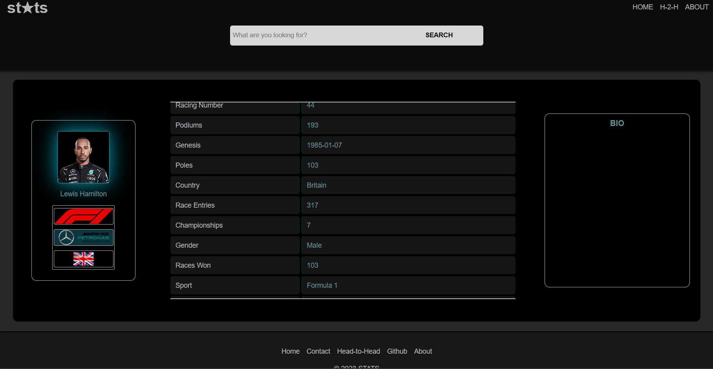

# ALX FOUNDATIONS PORTFOLIO PROJECT
### Project Name
STATS
### Introduction
Stats is a web application that provides insights into various sports, teams and athletes. I built it as the final project of the foundations phase of the ALX SE curriculum in which I am enrolled as a student.

[Live Project](https://boegaderrick.tech/stats)

[Project blog](https://medium.com/@boegaderrick/alx-foundations-portfolio-project-a6110ad714b3)

[Author Linkedin](https://linkedin.com/in/boegaderrick)

## Usage
To use the site visit the live link posted [above](https://boegaderrick.tech/stats), you will be directed to the project's landing page which has a button to navigate to the project's home page. On the home page a sport is loaded by default in one of the page's two sections, under it there is a section populated with all athletes and teams participating in the sport named in the section above.

### Features & Guide
* Search  (Under development)

    As the name suggests, users will be able to perform simple searches of the database for all available sports, teams and athletes instead of having to peruse through the displayed objects manually.
* Head-to-Head  (Under development)

    This will enable users to select two athletes or teams that fall under the same category and compare their attributes. 
* Navigation

    When the home page is loaded, a random sport's name and background image are loaded. On either side of the name there's a navigation arrow that when clicked changes the sport named to the next or previous one in the list of available sports, depending on which side was clicked. As a result of this change the section below is also re-populated accordingly.
* View

    The second section has two headlines (ATHLETES & TEAMS) and is meant to display both teams and athletes of a particular sport but for a better viewing experience only one category can be viewed at a time. The current view can be switched by clicking the header you want to view.

    To view a displayed object in more detail you can click it which will direct you to another page that shows all attributes and a short bio of the object you clicked.

## Contributions
Contributions and suggestions are welcome

## License
This project is licensed under the [MIT License](https://opensource.org/licenses/MIT).